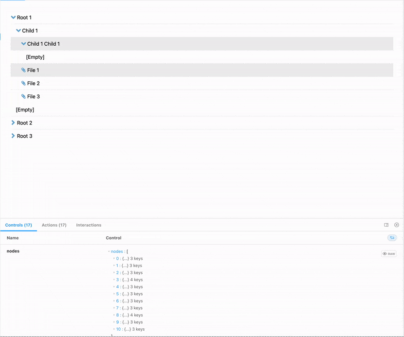
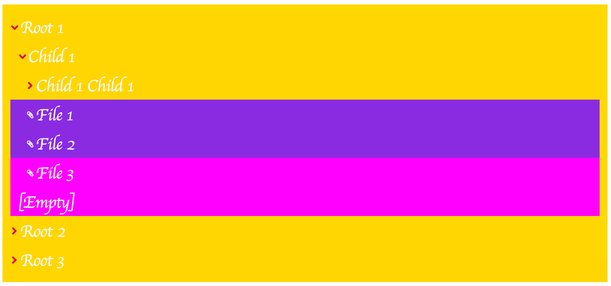

# react-tree

a hierarchical tree component for React in Typescript

[Demo+Docs here](https://naisutech.github.io/react-tree/)



## Features

- Written in Typescript will full typings exported from package
- Theming support for almost all parts of the components appearance, (**NEW** including partial theming) (see **Theming** below)
- Use as an uncontrolled component with `defaultSelectedNodes` and `defaultOpenNodes` or a completely controlled component with `selectedNodes` and `openNodes` props with `onEvent` listeners
- Fully stylable container for fixed width, or flex-box based layouts, or scrollable container when lists are too long for the parent container
- Optimized UX to clearly indicate open/closed folders, selected items and feedback on user input
- Toggle support for long-object labels with `truncateLongText` prop
- Title attributes on hover for truncated labels that are too long for container
- Toggle support for empty folders with `displayEmpty` prop
- Customizable component message strings with `messages` prop (no data, empty folders, loading) 
- Display a loading indicator and nothing when in loading state with `loading` prop
- Opt-in animated micro-interactions for opening/closing folders
- Multi-select API! hold your OS's `meta` key or `ctrl` key to be able to select/deselect multiple-nodes
- **NEW in v3** imperative API via export `useReactTreeApi` hook. Pass the ref to the componenta (see **Imperative API** below
- **NEW in v3** new context-based state management for better maintainability and handling of business logic
- **NEW in v3** moved `react-dom` and `styled-components` to `peerDependencies`
- **NEW in v3** Custom render functions for nodes and icons (full node context passed to render function with open/selected status)


## Add to a project

`yarn add @naisutech/react-tree` or `npm install @naisutech/react-tree`

## Usage

There is only one required prop: `nodes` (see **Data format**)

```jsx
import { ReactTree } from '@naisutech/react-tree'

// component code

const data = ... // fetch data

<ReactTree nodes={data}  />
```

## Data format

- data should be a flat list of node `objects` with required properties:
  - `label`,
  - `id`,
  - `parentId`
- optional properties:
  - `items`
- `id` is typed to be `number` or `string`
- root nodes should have `parentId` property set to `null`
- files/leaf items should be a flat list of node objects on `items` property inside a node.
- files do not require an `items` property (this should be obvious)
- example:

```json
[
  {
    "id": 12345678,
    "parentId": null,
    "label": "My parent node",
    "items": [
      {
        "id": 87654321,
        "label": "My file",
        "parentId": 12345678
      }
    ]
  },
  {
    "id": 56789012,
    "parentId": 12345678,
    "label": "My child node"
  }
]
```

## Component API

There are a number of optional properties which
can be used to customise the UX of your _React Tree_ component. You can explore the full interactive docs [here](https://naisutech.github.io/react-tree/) or you can refer to the sample code below:

```tsx
<ReactTree
  nodes: TreeNodeList
  defaultOpenNodes?: TreeNodeId[]
  defaultSelectedNodes?: TreeNodeId[]
  messages?: { noData?: React.ReactNode; loading?: React.ReactNode; emptyItems?: React.ReactNode }
  loading?: boolean
  theme?: string
  themes?: ThemeSettings
  enableItemAnimations?: boolean
  enableIndicatorAnimations?: boolean
  showEmptyItems?: boolean
  noIcons?: boolean
  truncateLongText?: boolean
  containerStyles?: React.CSSProperties
  RenderNode?: TreeRenderFn
  RenderIcon?: TreeRenderFn
  selectedNodes?: TreeNodeId[]
  openNodes?: TreeNodeId[]
  onToggleSelectedNodes?: (nodes: TreeNodeId[]) => void
  onToggleOpenNodes?: (nodes: TreeNodeId[]) => void
  ref: React.MutableRef<ReactTreeApi>
/>
```

### Props list

| **Prop name**               | **Prop type**                                                                           | **Default**                                                                       | **Required** | **Description**                                                                                                                                          |
|-----------------------------|-----------------------------------------------------------------------------------------|-----------------------------------------------------------------------------------|--------------|----------------------------------------------------------------------------------------------------------------------------------------------------------|
| `nodes`                     | `TreeNodeList`                                                                          | `[]`                                                                              | Y            | The data set for react tree to render                                                                                                                    |
| `defaultOpenNodes`          | `TreeNodeId[]`                                                                          | `undefined`                                                                       | N            | The default set of open nodes. Specify when you intend to use the component in uncontrolled mode                                                         |
| `defaultSelectedNodes`     | `TreeNodeId[]`                                                                          | `undefined`                                                                       | N            | The default set of selected nodes. Specify when you intend to use the component in uncontrolled mode                                                     |
| `openNodes`                 | `TreeNodeId[]`                                                                          | `undefined`                                                                       | N            | The currently open nodes. Specify when you intend to use the component in controlled mode.                                                               |
| `selectedNodes`             | `TreeNodeId[]`                                                                          | `undefined`                                                                       | N            | The currently selected nodes. Specify when you intend to use the component in controlled mode.                                                           |
| `theme`                     | `string`                                                                                | `light`                                                                           | N            | The curently selected theme (built-in themes are `light`, and `dark`)                                                                                    |
| `themes`                    | `ThemeSettings` (`Record<string, ReactTreeTheme>`)                                      | `{}`                                                                              | N            | The user-specified set of themes                                                                                                                         |
| `loading`                   | `boolean`                                                                               | `false`                                                                           | N            | Display a loader instead of the rendered tree                                                                                                            |
| `messages`                  | `{ noData?: React.ReactNode; loading?: React.ReactNode; emptyItems?: React.ReactNode }` | `{loading: 'Loading...', noData: 'No data to render 😔', emptyItems: '[Empty]' }` | N            | The default component message strings.                                                                                                                   |
| `enableItemAnimations`      | `boolean`                                                                               | `false`                                                                           | N            | Whether or not to animate folders on enter/exit                                                                                                          |
| `enableIndicatorAnimations` | `boolean`                                                                               | `false`                                                                           | N            | Whether or not to animate folder open/close icons                                                                                                        |
| `showEmptyItems`            | `boolean`                                                                               | `false`                                                                           | N            | Whether or not to display an indicator for empty folders                                                                                                 |
| `noIcons`                   | `boolean`                                                                               | `false`                                                                           | N            | Disable the icon display                                                                                                                                 |
| `truncateLongText`          | `boolean`                                                                               | `false`                                                                           | N            | Prepares all DOM nodes to be able to truncate long text nodes. Note this setting will have _no effect_ if container is not styled to have a fixed width. |
| `multiSelect`               | `boolean`                                                                               | `false`                                                                           | N            | Component is single select by default.                                                                                                                   |
| `containerStyles`           | `CSSProperties`                                                                         | `{}`                                                                              | N            | Style the _React Tree_ container                                                                                                                         |
| `RenderNode`                | `TreeRenderFn`                                                                          | `undefined`                                                                       | N            | A custom renderer for `Node` elements. See **Custom rendering**                                                                                          |
| `RenderIcon`                | `TreeRenderFn`                                                                          | `undefined`                                                                       | N            | A custom renderer for `Icon` elements. See **Custom rendering**                                                                                          |
| `onToggleSelectedNodes`     | `(nodes: TreeNodeId[]) => void`                                                         | () => void                                                                        | N            | A callback called whenever items are selected/deselected                                                                                                 |
| `onToggleOpenNodes`         | `(nodes: TreeNodeId[]) => void`                                                         | () => void                                                                        | N            | A callback called whenever items are opened/closed                                                                                                       |

## Typescript

_React Tree_ is written in typescript and is fully typescript compatible. All type definitions are exported directly from the library. See `src/types` in the repo for extensive definitions

## Imperative API

_React Tree_ exposes a hook `useReactTreeApi` which you can use to imperatively control the tree component. The hook returns a `React.MutableRef<ReactTreeApi>` type object. All you have to do is pass the returned object to the `ref` props on the _React Tree_ component. The `.current` property on the ref object will be populated with the API functions you need to fully control the component.

### Usage

```tsx
import ReactTree, { useReactTreeApi } from "@naisutech/react-tree"
const App = () => {
  const treeApi = useReactTreeApi()

  return <div>
    <button onClick={() => { treeApi.current.toggleAllNodesOpenState("open") }}>Expand all</button>
    <ReactTree
      nodes={[]}
      ref={treeApi}
    />
  </div>
}
```

### Docs

Full details of the _React Tree_ API:

```ts
interface ReactTreeApi {
  getOpenNodes: () => (number | string)[]  // get a list of all open nodes
  getSelectedNodes: () => (number | string)[] // get a list of all selected nodes
  toggleNodeSelectedState: (node: string | number) => void // toggle a node selected/unselected. This is an inclusive operation (all other selected nodes are retained)
  toggleNodeOpenState: (node: string | number) => void // toggle a node open. This is an inclusive operation (all other open nodes are retained)
  toggleAllNodesOpenState: (state: 'open' | 'closed') => void // open or close all nodes
  toggleAllNodesSelectedState: (state: 'selected' | 'unselected') => void // select or deselect all nodes
  toggleOpenNodes: (nodes: (number | string)[]) => void // toggle a set of nodes open. This is an additive operation (it's a union of already open and newly open nodes)
  toggleClosedNodes: (nodes: (number | string)[]) => void // toggle a set of nodes closed. This is an subtractive operation (it's a difference of already open and newly closed nodes)
  toggleOpenClosedNodes: (nodes: (number | string)[]) => void // toggle a set of nodes open. This is an exclusive operation (all other open nodes are closed)
  selectNodes: (nodes: (number | string)[]) => void // toggle a set of nodes selected. This is an additive operation (it's a union of already selected and newly selected nodes)
  deselectNodes: (nodes: (number | string)[]) => void // toggle a set of nodes deselected. This is an subtractive operation (it's a difference of already selected and newly deselected nodes)
  toggleSelectedNodes: (nodes: (number | string)[]) => void // toggle a set of nodes selected. This is an exclusive operation (all other selected nodes are deselected)
}
```

## Theming

_ReactTree_ supports custom theming. All values are CSS compatible properties. Provide the custom theme object to the `themes` prop (with a key matching your theme name) and provide your theme name to the `theme` prop.

### Theme API:

Note all props are optional. Any props not provided will use `initial` settings (e.g. `background-color: initial;`)

```ts
interface ReactTreeTheme {
  text?: {
    fontSize?: SizeUnit | CSSUnit
    fontFamily?: string
    color?: string
    selectedColor?: string | null
    hoverColor?: string | null
  }
  nodes?: {
    height?: CSSUnit
    folder?: {
      bgColor?: string
      selectedBgColor?: string
      hoverBgColor?: string | null
    }
    leaf?: {
      bgColor?: string
      selectedBgColor?: string
      hoverBgColor?: string | null
    }
    separator?: {
      border?: string
      borderColor?: string
    }
    icons?: {
      size?: CSSUnit
      folderColor?: string
      leafColor?: string
    }
  }
}
```

### Usage:

```ts
const myThemes: ThemeSettings = {
  {
  "exampleCustomTheme": {
    "text": {
      "fontSize": "xl",
      "fontFamily": "cursive",
      "color": "#fafafa",
      "selectedColor": "#fafafa",
      "hoverColor": "#fafafa"
    },
    "nodes": {
      "height": "3.5rem",
      "folder": {
        "bgColor": "gold",
        "selectedBgColor": "goldenrod",
        "hoverBgColor": "yellow"
      },
      "leaf": {
        "bgColor": "magenta",
        "selectedBgColor": "blueviolet",
        "hoverBgColor": "violet"
      },
      "separator": {
        "border": "3px solid",
        "borderColor": "transparent"
      },
      "icons": {
        "size": "1rem",
        "folderColor": "crimson",
        "leafColor": "white"
      }
    }
  }
}
}
```

```jsx
<Tree nodes={data} theme="exampleCustomTheme" themes={myThemes} />
```

> Result



## Custom render functions

_React Tree_ includes two props `RenderNode` and `RenderIcon` which can be used to fully customize the appearance and behaviour of the component

### API 

Icons and nodes both use the same API, `TreeRenderFn`:

```tsx
type TreeRenderFn = ({
  node,
  type,
  selected = false,
  open = false,
  context
}: {
  node: TreeNode
  type: 'leaf' | 'node' | 'loader'
  selected: boolean
  open?: boolean
  Icon?: React.ReactNode
  context: TReactTreeContext
}) => React.ReactNode
```

- `node: TreeNode` - the node data
- `type: 'leaf' | 'node' | 'loader'` - the type of this node
- `selected: boolean` - indicates whether node is selected or not
- `open: boolean` - use only for node, indicates whether node is open or not
- `icon: React.ReactNode` - the SVG component of the original _React Tree_ icon if you want to use it
- `context: TReactTreeContext` - the entire _React Tree_ context including the state, and API methods


### Nodes

_ReactTree_ will call (if provided) the `RenderNode` icon with the API for TreeRenderFn. This should be enough information to render any customization you need.

**N.B.** if you use the prop `truncateLongText` you'll notice that unless you properly style your custom node elements, it will take no effect. As explained elsewhere, you'll need to make sure that a) the container is styled to have a fixed width and b) that the custom node is styled `overflow-x: hidden;` and `text-overflow: ellipsis` to be rendered correctly. 

### Icons

_ReactTree_ comes with a pretty solid set of default icons for showing node elements and leaf elements. However, if you want to hide the icons, pass the `noIcons` prop.

If you want to customize the icons, you can! Some conditions:

- the icon is rendered inside a container which whose size is determined by theme property `icons.size`. It will render any child SVG or `img` element as `100%` height and width within that container

## TODO in v4 and beyond

- add drag and drop support

## Contributing

- open issues and PRs and we'll work together!
