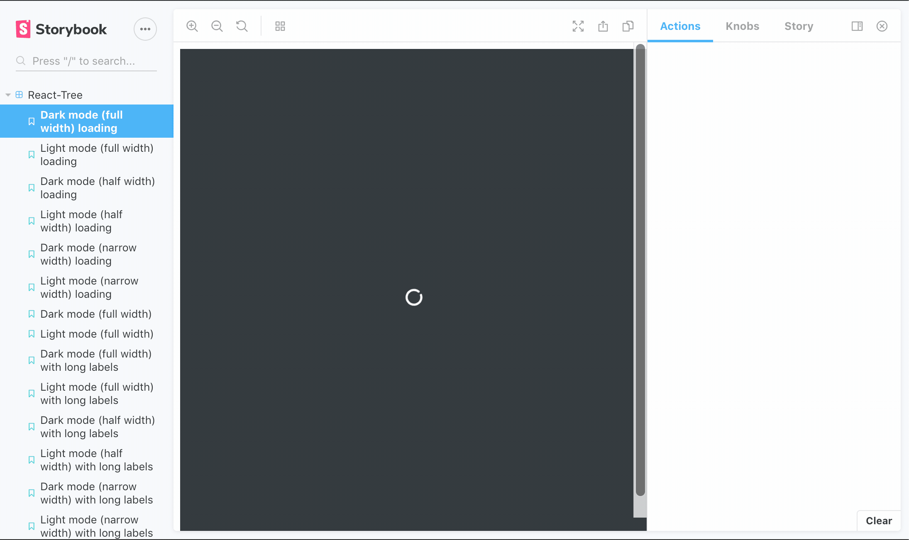
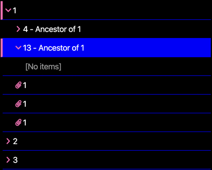

# react-tree

a hierarchical object tree component for React:

[DEMO here](https://codesandbox.io/s/naisu-techreact-tree-demo-oewiz)



- supports dark (default), light theme, and CUSTOM THEMES (see `Theming` below)
- supports three sizes: full width, half width and narrow (33%)
- supports full-height or content-height vertical sizing (flex-box based)
- optimized UX to clearly indicate open/closed folders, selected items and reactions to user input
- optimized for long object labels: ellipsis when labels become too large for container
- optimized for deeply nested structures: container becomes scrollable when nested items might become hidden outside of container
- empty indicator: if no data is provided, display a message to the user
- loading indicator: provide an `isLoading` prop to indicate that the component is not ready

## Add to a project

`yarn add @naisutech/react-tree` or `npm install @naisutech/react-tree`

## Usage

```jsx
import Tree from '@naisutech/react-tree'

// component code

const data = ... // fetch data
const onSelect = selectedNode => {
  // do something with selected node
}

<Tree nodes={data} onSelect={onSelect} />
```

## Data format

- data should be a flat list of nodes with at least `label`, `id`, `parentId` fields
- root nodes have `null` on `parentId` property
- files should be a flat list of nodes on `items` property inside a node, but can be `null`
- files do not require an `items` property (duh)
- example:

```json
[
  {
    "id": 12345678,
    "parentId": null,
    "label": "My parent node",
    "items": [
      {
        "id": 87654321,
        "label": "My file",
        "parentId": 12345678
      }
    ]
  },
  {
    "id": 56789012,
    "parentId": 12345678,
    "label": "My child node",
    "items": null
  }
]
```

## Api

```jsx
<Tree
  nodes={Array} // see data format
  onSelect={Function} // fired every click of node or leaf with selected item as argument
  theme={String} // defaults to 'dark'. Choose from ['light', 'dark']
  customTheme={Object} // see `Theming`
  size={String} // full (default), half, narrow
  grow // in a flex box, the tree will grow to fill available space. Best used with `flex-direction: column`
  showEmptyItems // show the empty items indicator in a folder
  isLoading //  show the loading spinner
/>
```

## Theming
`react-tree` supports custom theming. All values are CSS colours or hexes (.e.g. `#000`). Provide the theme object to the `customTheme` prop  and provide your theme name to the `theme` prop:

```js
  const myTheme = {
    'my-theme': {
      text: '#fff', 
      bg: '#000',
      highlight: 'blue', // the colours used for selected and hover items
      decal: 'hotpink', // the colours used  for open folder indicators and icons
      accent: '#999' // the colour used for row borders and empty file indicators
    }
  }
```

```jsx
  <Tree nodes={data} onSelect={onSelect} theme={'my-theme'} customTheme={myTheme} />
```

> Result



## Contributing

open issues and PRs and we'll work together
